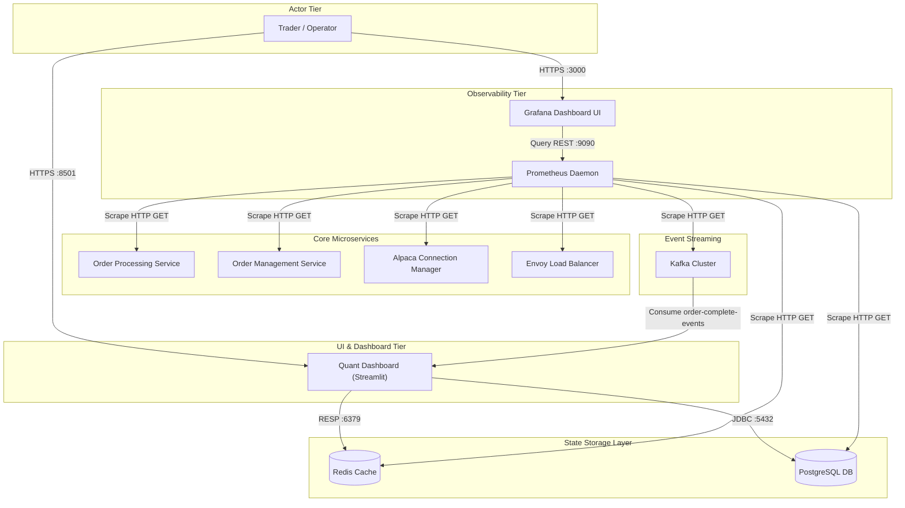
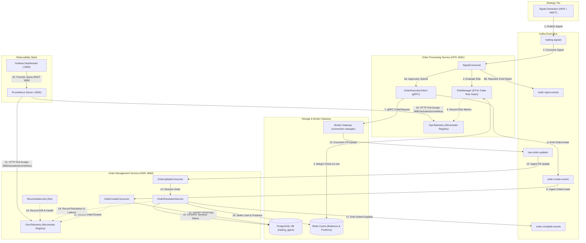

# High-Level Design (HLD): Observability & UI Components

This document describes the high-level architecture, design specifications, and interaction flows for the UI Dashboard (`quant-dashboard`) and the Observability stack (`Prometheus` & `Grafana`) within the `distributed-trading-system`.

---

## 1. Interaction Diagram

The component diagram below shows how the Observability and UI components interface with the core infrastructure, databases, and application services out-of-band to monitor health and render analytics.

Refer to the source diagram at [observability_ui_hld.puml](file:///c:/Users/jeshu/Projects/distributed-trading-system/design/hld/observability-ui/observability_ui_hld.puml).

---

## 2. Quant Dashboard Architecture

The `quant-dashboard` is an operator-facing control panel designed with **Streamlit** (Python). 

### Operational Constraints & Boundaries
*   **Read-Only Scope**: In its current deployment phase, the dashboard is strictly limited to read-only/pull operations. Write operations (such as manually executing override orders, or starting/stopping specific strategy instances) are completely disabled.
*   **Out-of-Path Execution**: The dashboard has no connection to the execution hot-path (OPS/OMS gRPC connections). It does not write to the database or Redis cache, preventing UI requests from blocking order execution.

### Data Ingress Interfaces
1.  **Live Position & Balance Cache (Redis)**:
    *   Queries live account cash balance via `GET balance:cash`.
    *   Queries active blocked margin limits via `GET balance:blocked`.
    *   Queries active positions per ticker via `GET positions:<symbol>`.
2.  **Order Audit Trail (Postgres)**:
    *   Queries transactional status records from the `tracked_orders` table (SQL query with pagination) to render historical trade logs.
3.  **Real-Time Fill Events (Kafka)**:
    *   Subscribes as a consumer group to the `order-complete-events` Kafka topic. Renders incoming normalization events (execution status, filled average price, total filled quantity) live on the dashboard UI.

---

## 3. Observability Stack Architecture

The Observability Stack utilizes **Prometheus** (time-series database and collector) and **Grafana** (telemetry dashboard) to monitor the entire trading pipeline.

### Prometheus Telemetry Scraping Model
Prometheus operates via a pull model, executing HTTP GET requests on the metrics endpoints of all whitelisted targets at regular scrape intervals (default: `15s`):

1.  **Java/Spring Boot Actuators (OPS & OMS)**:
    *   Endpoint: `/actuator/prometheus` (ports `8081` and `8082`).
    *   Exposes JVM runtime stats (heap utilization, garbage collection rates, thread pools), Hikari connection pool usage, HTTP handler latency, and Kafka consumer group lags.
2.  **Python Prometheus Clients (Connection Managers & Strategies)**:
    *   Endpoint: `/metrics` (FastAPI ports `8000`, `8001`, `8002`).
    *   Exposes custom application metrics such as WebSocket stream connect states, incoming tick ingestion rate, tick lag (timestamp delta between tick creation and ingestion), and gRPC unary execution success/fail counts.
3.  **Envoy Admin Exporter (tick-lb)**:
    *   Endpoint: `/stats/prometheus` (Envoy admin port `9901`).
    *   Exposes stats for gRPC load balancing, upstream cluster connection pools, dropped requests, and circuit-breaker triggers.
4.  **Database Exporters**:
    *   PostgreSQL: Scraping active database connections, transactions per second, and row locking states.
    *   Redis: Scraping total memory usage, active client connections, RESP command processing rates, and hit/miss ratios.

### Grafana Telemetry Dashboards
Grafana queries Prometheus for real-time visualization and alerting. Exposed boards include:
*   **Pipeline Latency (System Hot-Path)**: Visualizes the time elapsed for a tick to traverse the pipeline: `Tick Created (Alpaca) -> Ingested (CM) -> Routed (Envoy) -> Strategy Triggered (SignalGen) -> Signal Out (Kafka)`.
*   **JVM & Container Health**: Graphs memory leaks, thread starvation, CPU throttling, and connection bottlenecks.
*   **Reconciliation cron lag**: Tracks lag between unresolved transaction counts in Redis and final DB updates in Postgres.

---

## 4. Order Processing (OPS) & Order Management (OMS) Telemetry Architecture

The diagram below details the exact telemetry data paths, Kafka topics, risk evaluation gates, order persistence, and Prometheus pull mechanisms for OPS and OMS.

Refer to the PlantUML definition: [ops_oms_telemetry_flow.puml](file:///c:/Users/jeshu/Projects/distributed-trading-system/design/hld/observability-ui/ops_oms_telemetry_flow.puml).

