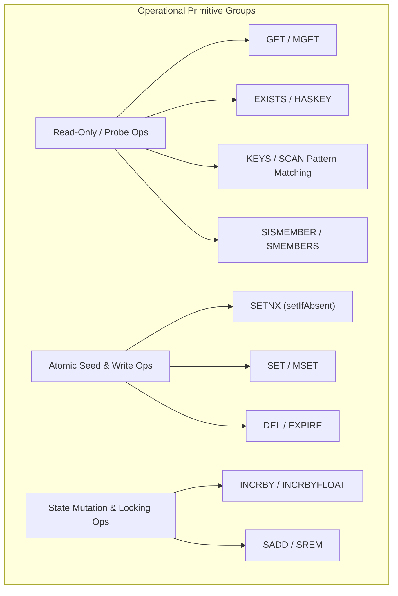

# Distributed Trading System - Redis Keyspace & Operations Flow Architecture

## Architectural Overview

Redis serves as the high-throughput, low-latency in-memory state store for the Distributed Trading System. In accordance with **ADR-005 (Provider Isolation & Fail-Fast Risk Controls)**, all Redis keys strictly adhere to canonical key templates, keyspace scoping rules, type contracts, and fallback semantics managed by the [`TradingRedisFacade`](file:///c:/Users/jeshu/Projects/distributed-trading-system/CombinedOrderingSystem/libs/shared-models/src/main/java/com/trading/shared/redis/TradingRedisFacade.java).

This document serves as the master catalog and architectural entry point for all Redis key read, write, increment, set, and TTL operations across application startup, runtime signal processing, scheduled background jobs, and out-of-band price caching.

---

## 1. Canonical Redis Keyspace Catalog

| Key Pattern | Scope | Data Type | Default Seed / Fallback | Allowed Default | Purpose & Description |
| :--- | :--- | :--- | :--- | :--- | :--- |
| `system:defaults:<domain>` | `GLOBAL` | `String` | Varies per `RedisKeyDef` | N/A (Seed Source) | Centralized seed store populated by `RedisDefaultsInitializer` at startup. |
| `system:kill_switch` | `GLOBAL` | `Boolean` (`"true"`/`"false"`) | `system:defaults:system:kill_switch` (`"false"`) | Yes | Emergency global circuit breaker halting order placement across all providers. |
| `system:kill_switch:<provider>` | `PROVIDER` | `Boolean` (`"true"`/`"false"`) | `system:defaults:system:kill_switch:provider` (`"false"`) | Yes | Provider-specific circuit breaker toggle. |
| `provider:status:<provider>` | `PROVIDER` | `String` (`"ACTIVE"`/`"INACTIVE"`) | `system:defaults:provider:status` (`"INACTIVE"`) | Yes | Provider connection health and account readiness state. |
| `balance:cash:<provider>` | `PROVIDER` | `Double` (numeric string) | **None** (Fail-Fast) | **No** | Available unallocated cash balance for the broker provider. |
| `balance:blocked:<provider>` | `PROVIDER` | `Double` (numeric string) | **None** (Fail-Fast, Must be `0.0`) | **No** | Reserved margin locked for pending working orders. |
| `balance:starting_equity:<provider>` | `PROVIDER` | `Double` (numeric string) | **None** (Fail-Fast) | **No** | Day-start equity baseline captured at midnight rollover for daily loss calculation. |
| `balance:last_reset_date:<provider>` | `PROVIDER` | `String` (ISO Date `YYYY-MM-DD`) | **None** (Fail-Fast) | **No** | Date string tracking the last daily equity rollover execution. |
| `positions:<provider>:<symbol>` | `PROVIDER_AND_SYMBOL` | `Integer` (share count) | `system:defaults:positions` (`"0"`) | Yes (Sparse) | Current net share holdings per provider and symbol. |
| `market:last_price:<symbol>` | `SYMBOL` | `Double` (numeric string) | **None** | **No** | Global fallback reference price written by `price-cache-service`. |
| `market:last_price:<provider>:<symbol>` | `PROVIDER_AND_SYMBOL` | `Double` (numeric string) | **None** | **No** | Primary provider-specific market reference price. |
| `risk:config:max_daily_loss:<provider>` | `PROVIDER` | `Double` (monetary limit) | **None** (Fail-Fast) | **No** | Maximum allowable daily equity loss threshold. |
| `risk:config:price_collar_pct:<provider>` | `PROVIDER` | `Double` (percentage) | `system:defaults:risk:price_collar_pct` (`"1.50"`) | Yes | Maximum allowable signal price deviation from reference price (%). |
| `risk:config:velocity_per_sec:<provider>` | `PROVIDER` | `Integer` (count) | `system:defaults:risk:velocity_per_sec` (`"5"`) | Yes | Maximum order rate per second. |
| `risk:config:velocity_per_min:<provider>` | `PROVIDER` | `Integer` (count) | `system:defaults:risk:velocity_per_min` (`"30"`) | Yes | Maximum order rate per minute. |
| `risk:config:max_order_qty:<provider>` | `PROVIDER` | `Integer` (shares) | `system:defaults:risk:max_order_qty` (`"500"`) | Yes | Single-order share quantity cap. |
| `risk:config:max_order_val:<provider>` | `PROVIDER` | `Double` (monetary limit) | **None** (Fail-Fast) | **No** | Single-order monetary cost cap ($). |
| `risk:config:max_concentration_pct:<provider>`| `PROVIDER` | `Double` (percentage) | `system:defaults:risk:max_concentration_pct` (`"20.0"`) | Yes | Portfolio equity concentration limit per symbol (%). |
| `risk:config:stop_loss_pct:<provider>` | `PROVIDER` | `Double` (percentage) | `system:defaults:risk:stop_loss_pct` (`"2.0"`) | Yes | Automatic stop-loss price distance (%). |
| `risk:velocity:sec:<provider>:<epoch_sec>` | `PROVIDER_AND_EPOCH` | `Integer` (counter) | Dynamic counter (2s TTL) | Yes | Sliding second window rate limiter. |
| `risk:velocity:min:<provider>:<epoch_min>` | `PROVIDER_AND_EPOCH` | `Integer` (counter) | Dynamic counter (120s TTL) | Yes | Sliding minute window rate limiter. |

---

## 2. Operational Read / Write Classification Matrix

The system categorizes all Redis operations into distinct operational levels to ensure proper concurrency, state isolation, and auditability:

### Operational Access Summary

1. **Bootstrap & Seeding (Atomic Seed Ops)**:
   - Executed strictly via `SETNX` (`opsForValue().setIfAbsent`) during application bootstrap by [`RedisDefaultsInitializer`](file:///c:/Users/jeshu/Projects/distributed-trading-system/CombinedOrderingSystem/libs/shared-models/src/main/java/com/trading/shared/redis/RedisDefaultsInitializer.java).
   - Populates seed keys (`system:defaults:*`) without overwriting active operational keys.

2. **Pre-Trade Risk Inspection (Read-Only & Rate-Limit Mutators)**:
   - Executed by [`RiskManager`](file:///c:/Users/jeshu/Projects/distributed-trading-system/CombinedOrderingSystem/ms/order-processing-service/src/main/java/com/trading/ops/service/RiskManager.java) during order intake.
   - Evaluates 7 risk gates using `GET`, `EXISTS`, and `INCRBY` on sliding velocity keys (`risk:velocity:*`).

3. **Margin Locking (State Mutator Ops)**:
   - Executed by [`RiskManager`](file:///c:/Users/jeshu/Projects/distributed-trading-system/CombinedOrderingSystem/ms/order-processing-service/src/main/java/com/trading/ops/service/RiskManager.java) upon risk approval.
   - Atomically locks margin (`INCRBYFLOAT balance:blocked:<provider> +cost`).

4. **Post-Trade Order Resolution (State Mutator & Position Ops)**:
   - Executed by [`OrderResolutionService`](file:///c:/Users/jeshu/Projects/distributed-trading-system/CombinedOrderingSystem/ms/order-management-service/src/main/java/com/trading/oms/service/OrderResolutionService.java) and [`PositionStateManager`](file:///c:/Users/jeshu/Projects/distributed-trading-system/CombinedOrderingSystem/libs/shared-models/src/main/java/com/trading/shared/state/PositionStateManager.java) upon receiving execution fills.
   - Releases blocked margin (`INCRBYFLOAT balance:blocked:<provider> -cost`), adjusts cash balance (`INCRBYFLOAT balance:cash:<provider> +/-cost`), and updates share position (`SET positions:<provider>:<symbol>`).

5. **Scheduled Maintenance & Health Recovery (Health & Rollover Ops)**:
   - Executed by [`ProviderHealthCheckJob`](file:///c:/Users/jeshu/Projects/distributed-trading-system/CombinedOrderingSystem/ms/order-management-service/src/main/java/com/trading/oms/job/ProviderHealthCheckJob.java) and [`DailyEquityRefreshJob`](file:///c:/Users/jeshu/Projects/distributed-trading-system/CombinedOrderingSystem/ms/order-management-service/src/main/java/com/trading/oms/job/DailyEquityRefreshJob.java).
   - Probes non-defaultable keys using `EXISTS` via [`ProviderStateManager`](file:///c:/Users/jeshu/Projects/distributed-trading-system/CombinedOrderingSystem/libs/shared-models/src/main/java/com/trading/shared/state/ProviderStateManager.java), sets provider health (`SET provider:status:<provider>`), and executes midnight equity baselining (`SET balance:starting_equity:<provider>`).

6. **Out-of-Band Price Ingestion & Client Streaming (High-Frequency Batch Ops)**:
   - Executed by Python [`price-cache-service`](file:///c:/Users/jeshu/Projects/distributed-trading-system/price-cache-service/main.py) and Node.js [`web-app`](file:///c:/Users/jeshu/Projects/distributed-trading-system/web-app/server/index.ts) Fastify BFF.
   - Flushes sub-second tick batches via atomic `MSET market:last_price:<symbol> <price>` and reads live prices via `MGET` for UI WebSocket streaming.

---

## 3. Flow Specification Index

Comprehensive sequence diagrams, PlantUML sources, and low-level step documentation are split into four dedicated flow guides:

1. **[Startup Flow (`startup.md`)](file:///c:/Users/jeshu/Projects/distributed-trading-system/design/redis-keys-flow/startup.md)**
   - Spring Boot bootstrap, `RedisDefaultsInitializer` non-destructive seeding, `ProviderStateManager` required key checks, `OrderExecutionClient` gRPC probing, and provider status activation.

2. **[Runtime Signal Event Flow (`runtime-signal-event.md`)](file:///c:/Users/jeshu/Projects/distributed-trading-system/design/redis-keys-flow/runtime-signal-event.md)**
   - Kafka signal consumption in `SignalConsumer`, 7-gate pre-trade risk evaluation, margin locking & pending order set tracking in OPS, gRPC execution, and post-trade cash/margin/position settlement in OMS.

3. **[Jobs Flow (`jobs.md`)](file:///c:/Users/jeshu/Projects/distributed-trading-system/design/redis-keys-flow/jobs.md)**
   - Scheduled maintenance background jobs in OMS (`ProviderHealthCheckJob`, `ReconciliationJob`, `DailyEquityRefreshJob`), gRPC account reconciliation, and Redis state recovery.

4. **[Price Cache Service Flow (`price-cache-service.md`)](file:///c:/Users/jeshu/Projects/distributed-trading-system/design/redis-keys-flow/price-cache-service.md)**
   - Out-of-band market data streaming, micro-batch RAM buffer, pipelined `MSET` to Redis, ADR-005 market price resolution, and Web App BFF `MGET` polling for WebSocket cockpit delivery.
