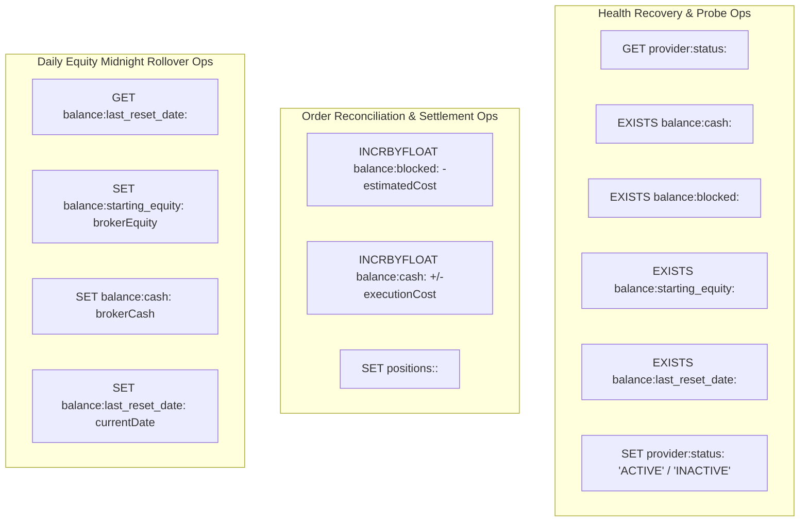

# Jobs Flow - Scheduled Maintenance & Reconciliation Background Jobs

## Overview

The **Jobs Flow** specifies the background execution loops managed by `@Scheduled` Spring components in `order-management-service` (OMS). It covers provider health recovery and state completeness inspection, pending order status reconciliation with the broker gateway, and daily midnight equity baselining per exchange timezone.

---

## PlantUML Sequence Diagram

```puml
@startuml
!include jobs.puml
@enduml
```

---

## Detailed Step-by-Step Execution Sequence

### Job 1: Provider Health Check & State Recovery (`ProviderHealthCheckJob`)
- **Schedule**: Runs every 15 seconds (`trading.health-check.interval-ms=15000`).
- **Execution Flow**:
  1. Inspects provider status in Redis via [`ProviderStateManager.getProviderStatus(provider)`](file:///c:/Users/jeshu/Projects/distributed-trading-system/CombinedOrderingSystem/libs/shared-models/src/main/java/com/trading/shared/state/ProviderStateManager.java) (`GET provider:status:<provider>`).
  2. If status is `"INACTIVE"`, probes gRPC health against `connection-manager-alpaca:50051` (`checkHealth("alpaca")`).
  3. If gRPC returns `HEALTHY`, calls [`ProviderStateManager.markProviderActive("alpaca")`](file:///c:/Users/jeshu/Projects/distributed-trading-system/CombinedOrderingSystem/libs/shared-models/src/main/java/com/trading/shared/state/ProviderStateManager.java).
  4. **Completeness Verification**: `markProviderActive()` verifies that all mandatory non-defaultable keys exist in Redis (`EXISTS balance:cash:alpaca`, `balance:blocked:alpaca`, `balance:starting_equity:alpaca`, `balance:last_reset_date:alpaca`, `risk:config:max_daily_loss:alpaca`, `risk:config:max_order_val:alpaca`).
  5. **State Transition**:
     - If all keys exist: Writes `provider:status:alpaca` = `"ACTIVE"` (`SET`).
     - If any key is missing: Retains `provider:status:alpaca` = `"INACTIVE"` (`SET`) and logs missing key definitions.

### Job 2: Pending Order Reconciliation (`ReconciliationJob`)
- **Schedule**: Runs every 30 seconds (`trading.reconciliation.interval-ms=30000`).
- **Execution Flow**:
  1. Queries PostgreSQL database `TrackedOrderRepository.findByStatus("PENDING")`.
  2. For each pending order, queries Connection Manager via gRPC `getOrderStatus(provider, orderId)`.
  3. **Order Completion Handling**: If broker status is `"filled"` or `"completed"`, delegates to [`OrderResolutionService.resolveOrder(orderId, "COMPLETED", filledQty, avgPrice)`](file:///c:/Users/jeshu/Projects/distributed-trading-system/CombinedOrderingSystem/ms/order-management-service/src/main/java/com/trading/oms/service/OrderResolutionService.java):
     - Updates PostgreSQL `tracked_orders` status to `"COMPLETED"`.
     - Releases blocked margin (`INCRBYFLOAT balance:blocked:<provider> -estimatedCost`).
     - Adjusts cash balance (`INCRBYFLOAT balance:cash:<provider> +/-executionCost`).
     - Settles position via [`PositionStateManager.settlePosition()`](file:///c:/Users/jeshu/Projects/distributed-trading-system/CombinedOrderingSystem/libs/shared-models/src/main/java/com/trading/shared/state/PositionStateManager.java) (`SET positions:<provider>:<symbol>`).
  4. **Order Failure Handling**: If broker status is `"canceled"`, `"rejected"`, or `"expired"`, calls `OrderResolutionService.resolveOrder(orderId, "FAILED", ...)`:
     - Updates PostgreSQL status to `"FAILED"`.
     - Releases blocked margin (`INCRBYFLOAT balance:blocked:<provider> -estimatedCost`).

### Job 3: Daily Equity Midnight Rollover (`DailyEquityRefreshJob`)
- **Schedule**: Evaluates every minute (`cron = "0 * * * * *"`).
- **Execution Flow**:
  1. Inspects provider configuration timezone (e.g. `America/New_York` for NASDAQ/Alpaca) and computes current local exchange date.
  2. Reads last reset date from Redis via `redisFacade.getString(BALANCE_LAST_RESET_DATE, provider)` (`GET balance:last_reset_date:<provider>`).
  3. **Rollover Trigger**: If `providerCurrentLocalDate != providerLastResetDate`:
     - Calls [`EquityReconciliationService.reconcileDailyStartingEquity(providerConfig, rolloverDate)`](file:///c:/Users/jeshu/Projects/distributed-trading-system/CombinedOrderingSystem/ms/order-management-service/src/main/java/com/trading/oms/service/EquityReconciliationService.java).
     - Queries broker account details via gRPC `getAccountDetails(provider)`:
       - Overwrites day-start equity baseline: `SET balance:starting_equity:<provider> brokerEquity`.
       - Resyncs cash balance: `SET balance:cash:<provider> brokerCash`.
       - Updates reset date: `SET balance:last_reset_date:<provider> YYYY-MM-DD`.
     - **Fallback Calculation**: If broker gRPC fails, reads `balance:cash:<provider>` (`GET`), calculates open positions value via `PositionStateManager.calculateOpenPositionsValue(provider)` (`KEYS` + `GET`), writes `closingEquity = cash + positionsVal` to `balance:starting_equity:<provider>` (`SET`), and updates reset date (`SET`).

---

## Operational Level Reads & Writes Grouping



### Detailed Operational Key Operations Table

| Key Pattern | Operation Type | Redis Primitive | Caller Method | Operational Purpose |
| :--- | :--- | :--- | :--- | :--- |
| `provider:status:<provider>` | Read & Write | `GET` / `SET` | `ProviderHealthCheckJob` | Inspects status & restores active health state. |
| `balance:cash:<provider>` | Read-Only Probe | `EXISTS` | `ProviderStateManager.getMissingRequiredProviderKeys` | Validates cash balance cache completeness. |
| `balance:blocked:<provider>` | Mutator | `INCRBYFLOAT` | `OrderResolutionService.settleCache` | Releases locked margin (`-cost`) upon resolution. |
| `positions:<provider>:<symbol>` | Mutator | `SET` | `PositionStateManager.settlePosition` | Updates position quantity on order completion. |
| `balance:last_reset_date:<provider>`| Read & Write | `GET` / `SET` | `DailyEquityRefreshJob` / `EquityReconciliationService` | Checks & updates daily rollover date (`YYYY-MM-DD`). |
| `balance:starting_equity:<provider>`| Overwrite | `SET` | `EquityReconciliationService.reconcileDailyStartingEquity` | Sets opening equity baseline for daily drawdown check. |
