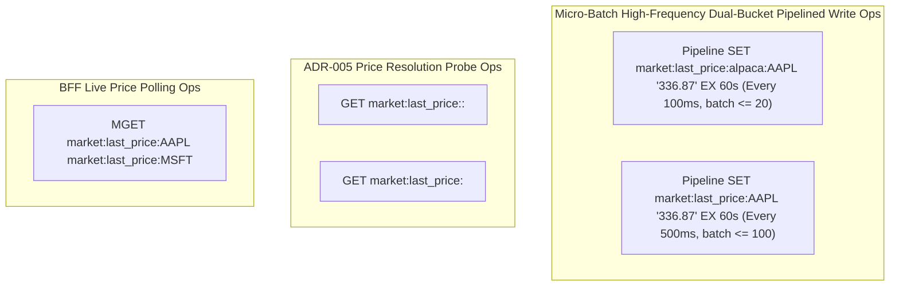

# Price Cache Service Flow - Market Data Ingestion & Price Resolution

## Overview

The **Price Cache Service Flow** specifies out-of-band market data tick processing, high-frequency dual-bucket RAM buffering, pre-computed pattern key resolution, micro-batch pipelined Redis writes with configurable TTL, ADR-005 compliant reference price resolution in Java microservices, and live WebSocket price streaming to the Web Trading Cockpit.

---

## PlantUML Sequence Diagram

<!-- ```puml
@startuml -->
!include price-cache-service.puml
<!-- @enduml
``` -->

---

## Detailed Step-by-Step Execution Sequence

### Phase 1: High-Frequency Tick Ingestion & Dual-Bucket RAM Buffering
1. **gRPC Subscription**: Python [`price-cache-service`](file:///c:/Users/jeshu/Projects/distributed-trading-system/price-cache-service/main.py) establishes an `asyncio` gRPC stream connection (`StreamMarketData`) to Connection Manager gateways (`connection-manager-alpaca:50051`).
2. **Tick Extraction**: As tick bars arrive, `consume_provider_stream` extracts:
   - `symbol`: from `bar_proto.symbol` (normalized to uppercase).
   - `provider`: from `bar_proto.provider` (with fallback to stream connection `provider_name`, normalized to lowercase).
   - `close_price`: from `bar_proto.close`.
3. **Pre-computed Pattern Key Resolution**: [`KeyPatternResolver`](file:///c:/Users/jeshu/Projects/distributed-trading-system/price-cache-service/config.py) maps the tick to:
   - **Provider-scoped Primary Key**: `get_provider_key(provider, symbol)` using `{pattern}:{provider}:{symbol}` (e.g. `market:last_price:alpaca:AAPL`).
   - **Symbol-scoped Backup Key**: `get_symbol_key(symbol)` using `{pattern}:{symbol}` (e.g. `market:last_price:AAPL`).
   All pattern resolutions are cached in-memory in $O(1)$ lookup structures.
4. **Dual-Bucket RAM Buffering**: `PriceCacheEngine.update_price` buffers the tick price into two independent in-memory buckets:
   - `provider_bucket`: smaller bucket for primary provider keys.
   - `symbol_bucket`: larger bucket for global symbol fallback keys.

3. ### Phase 2: Dual Micro-Batch Redis Flush Loops (Pipelined with Granular TTL)
1. **Provider-Scoped Primary Flush Loop**:
   - **Trigger**: Wakes up every `PROVIDER_FLUSH_INTERVAL_SEC` (default: **0.1s / 100ms**).
   - **Drain**: Drains up to `PROVIDER_MAX_BATCH_SIZE` (default: **20 keys**) under `asyncio.Lock`.
   - **Pipelined Write with Granular TTL**: Flushes via Redis pipeline setting TTL (default: **1.0s** in microservice engine, overridden to **60s** in `docker-compose.yml` for paper account feeds):
     ```python
     pipe = self.redis_client.pipeline(transaction=False)
     ttl_ms = int(ttl_sec * 1000)
     for k, v in snapshot.items():
         if ttl_ms % 1000 == 0:
             pipe.set(k, v, ex=int(ttl_sec))
         else:
             pipe.set(k, v, px=ttl_ms)  # Sub-second millisecond granularity
     pipe.execute()
     ```
2. **Symbol-Scoped Backup Flush Loop**:
   - **Trigger**: Wakes up every `SYMBOL_FLUSH_INTERVAL_SEC` (default: **0.5s / 500ms**).
   - **Drain**: Drains up to `SYMBOL_MAX_BATCH_SIZE` (default: **100 keys**) under `asyncio.Lock`.
   - **Pipelined Write with Granular TTL**: Flushes via Redis pipeline setting sub-second `px` or second `ex` TTL.
3. **Telemetry Recording**: Increments Prometheus counter metrics `price_cache_flush_total{bucket="provider"|"symbol"}` and `price_cache_keys_updated_total{bucket="provider"|"symbol"}`.

### Phase 3: ADR-005 Price Resolution in Java Services (OPS / OMS)
When pre-trade risk evaluation (`RiskManager`) or portfolio valuation (`PositionStateManager`) requires a market price for a symbol:
1. Calls [`TradingRedisFacade.getMarketPrice(provider, symbol)`](file:///c:/Users/jeshu/Projects/distributed-trading-system/CombinedOrderingSystem/libs/shared-models/src/main/java/com/trading/shared/redis/TradingRedisFacade.java).
2. **Primary Provider Key Lookup**: Queries `market:last_price:<provider>:<symbol>` (e.g. `market:last_price:alpaca:AAPL`) via `GET`.
3. **Global Fallback Key Lookup**: If the provider-specific key is absent, queries global reference key `market:last_price:<symbol>` (e.g. `market:last_price:AAPL`) via `GET`.
4. **Fail-Fast Enforcement**: If both keys are absent in Redis (or expired past the 60s TTL), throws [`MissingRedisStateException`](file:///c:/Users/jeshu/Projects/distributed-trading-system/CombinedOrderingSystem/libs/shared-models/src/main/java/com/trading/shared/redis/MissingRedisStateException.java), halting execution cleanly rather than using arbitrary `$100.0` price fallbacks.

### Phase 4: BFF Polling & Web Cockpit WebSocket Delivery
1. **Fastify BFF Connection**: Node.js [`web-app/server/index.ts`](file:///c:/Users/jeshu/Projects/distributed-trading-system/web-app/server/index.ts) connects to Redis on startup (`new Redis(...)`).
2. **Live Price Polling**: When client UI connects to WebSocket route `/ws`, an interval timer runs every 1000ms:
   - Invokes `getLivePricesFromRedis(["AAPL", "MSFT"])`.
   - Executes atomic multi-key get **`MGET market:last_price:AAPL market:last_price:MSFT`**.
3. **WebSocket Broadcast**: Encapsulates live prices into JSON tick messages (`{"type": "tick", "payload": {"symbol": "AAPL", "price": 336.87, "source": "redis"}}`) and streams them to the client browser UI.

---

## Operational Level Reads & Writes Grouping



### Detailed Operational Key Operations Table

| Key Pattern | Operation Type | Redis Primitive | Caller Service / Class | Operational Purpose |
| :--- | :--- | :--- | :--- | :--- |
| `market:last_price:<provider>:<symbol>`| Dual-Bucket Pipelined Write | `SET ... EX 60` | Python `price-cache-service` (`main.py`) | Flushes primary provider-specific price snapshots (100ms, batch <= 20, 60s TTL). |
| `market:last_price:<symbol>` | Dual-Bucket Pipelined Write | `SET ... EX 60` | Python `price-cache-service` (`main.py`) | Flushes backup global symbol price snapshots (500ms, batch <= 100, 60s TTL). |
| `market:last_price:<provider>:<symbol>`| Primary Price Read | `GET` | Java `TradingRedisFacade.getMarketPrice` | Provider-specific market reference price check. |
| `market:last_price:<symbol>` | Fallback Price Read | `GET` | Java `TradingRedisFacade.getMarketPrice` | Global fallback reference price check. |
| `market:last_price:<symbol>` | Multi-Key Price Read | `MGET` | Node.js Fastify BFF (`web-app/server/index.ts`) | Batch reads live prices for WebSocket UI client streaming. |
