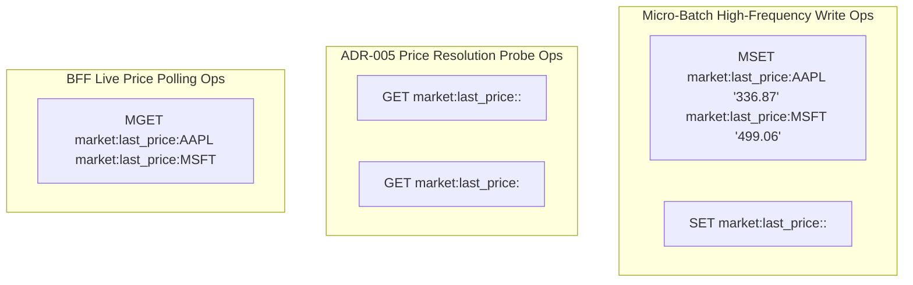

# Price Cache Service Flow - Market Data Ingestion & Price Resolution

## Overview

The **Price Cache Service Flow** specifies out-of-band market data tick processing, high-frequency RAM buffering, micro-batch pipelined Redis writes, ADR-005 compliant reference price resolution in Java microservices, and live WebSocket price streaming to the Web Trading Cockpit.

---

## PlantUML Sequence Diagram

<!-- ```puml
@startuml -->
!include price-cache-service.puml
<!-- @enduml
``` -->

---

## Detailed Step-by-Step Execution Sequence

### Phase 1: High-Frequency Tick Ingestion & Sub-Nanosecond RAM Buffering
1. **gRPC Subscription**: Python [`price-cache-service`](file:///c:/Users/jeshu/Projects/distributed-trading-system/price-cache-service/main.py) establishes an `asyncio` gRPC stream connection (`StreamMarketData`) to Connection Manager gateways (`connection-manager-alpaca:50051`).
2. **RAM Ingestion**: As tick bars arrive, `PriceCacheEngine.update_price(symbol, close_price, provider)` writes price values directly into an in-memory Python dictionary buffer (`self.buffer[key] = str(price)`). This operation completes in sub-nanosecond RAM time without blocking thread execution.

### Phase 2: Micro-Batch Redis Flush Loop
1. **Periodic Trigger**: An `asyncio` background task (`flush_loop()`) wakes up every `FLUSH_INTERVAL_SEC` (default: 0.5s / 500ms).
2. **Buffer Lock & Drain**: Acquires `asyncio.Lock`, snapshots non-empty buffer entries up to `MAX_BATCH_SIZE` (default: 100 keys), and clears processed keys from the RAM buffer.
3. **Pipelined Atomic Flush**: Executes single atomic **`MSET`** payload against Redis:
   ```python
   self.redis_client.mset(snapshot)
   # Writes: market:last_price:AAPL = "336.87", market:last_price:MSFT = "499.06"
   ```
4. **Telemetry Recording**: Increments Prometheus counter metrics `price_cache_flush_total` and `price_cache_keys_updated_total`.

### Phase 3: ADR-005 Price Resolution in Java Services (OPS / OMS)
When pre-trade risk evaluation (`RiskManager`) or portfolio valuation (`PositionStateManager`) requires a market price for a symbol:
1. Calls [`TradingRedisFacade.getMarketPrice(provider, symbol)`](file:///c:/Users/jeshu/Projects/distributed-trading-system/CombinedOrderingSystem/libs/shared-models/src/main/java/com/trading/shared/redis/TradingRedisFacade.java).
2. **Primary Provider Key Lookup**: Queries `market:last_price:<provider>:<symbol>` (e.g. `market:last_price:alpaca:AAPL`) via `GET`.
3. **Global Fallback Key Lookup**: If the provider-specific key is absent, queries global reference key `market:last_price:<symbol>` (e.g. `market:last_price:AAPL`) via `GET`.
4. **Fail-Fast Enforcement**: If both keys are absent in Redis, throws [`MissingRedisStateException`](file:///c:/Users/jeshu/Projects/distributed-trading-system/CombinedOrderingSystem/libs/shared-models/src/main/java/com/trading/shared/redis/MissingRedisStateException.java), halting execution cleanly rather than using arbitrary `$100.0` price fallbacks.

### Phase 4: BFF Polling & Web Cockpit WebSocket Delivery
1. **Fastify BFF Connection**: Node.js [`web-app/server/index.ts`](file:///c:/Users/jeshu/Projects/distributed-trading-system/web-app/server/index.ts) connects to Redis on startup (`new Redis(...)`).
2. **Live Price Polling**: When client UI connects to WebSocket route `/ws`, an interval timer runs every 1000ms:
   - Invokes `getLivePricesFromRedis(["AAPL", "MSFT"])`.
   - Executes atomic multi-key get **`MGET market:last_price:AAPL market:last_price:MSFT`**.
3. **WebSocket Broadcast**: Encapsulates live prices into JSON tick messages (`{"type": "tick", "payload": {"symbol": "AAPL", "price": 336.87, "source": "redis"}}`) and streams them to the client browser UI.

---

## Operational Level Reads & Writes Grouping



### Detailed Operational Key Operations Table

| Key Pattern | Operation Type | Redis Primitive | Caller Service / Class | Operational Purpose |
| :--- | :--- | :--- | :--- | :--- |
| `market:last_price:<symbol>` | Micro-Batch Atomic Write | `MSET` | Python `price-cache-service` (`main.py`) | Flushes 500ms market price snapshots in single atomic payload. |
| `market:last_price:<provider>:<symbol>`| Atomic Write | `SET` | Provider Market Feed Adapters | Optional provider-namespaced price override. |
| `market:last_price:<provider>:<symbol>`| Primary Price Read | `GET` | Java `TradingRedisFacade.getMarketPrice` | Provider-specific market reference price check. |
| `market:last_price:<symbol>` | Fallback Price Read | `GET` | Java `TradingRedisFacade.getMarketPrice` | Global fallback reference price check. |
| `market:last_price:<symbol>` | Multi-Key Price Read | `MGET` | Node.js Fastify BFF (`web-app/server/index.ts`) | Batch reads live prices for WebSocket UI client streaming. |
