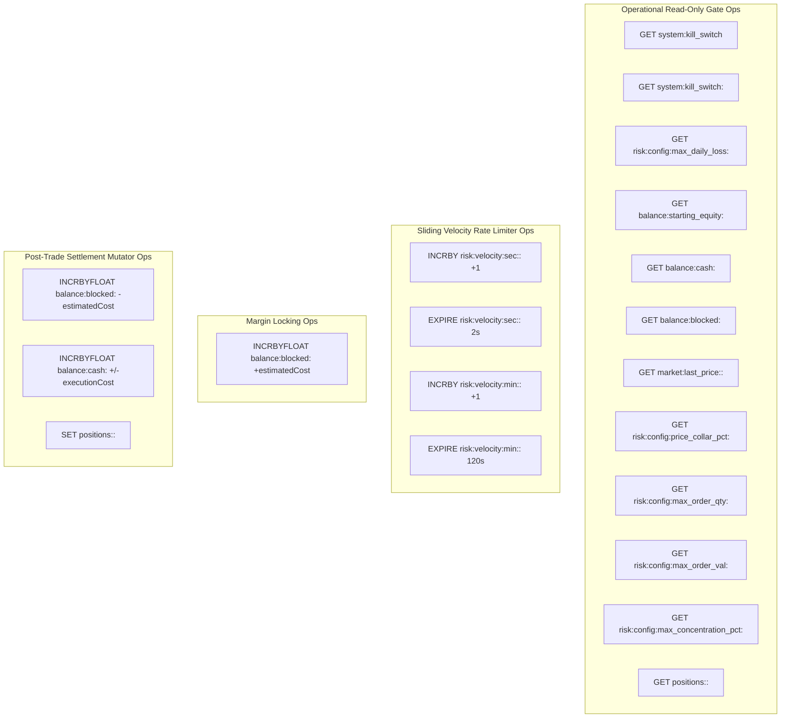

# Runtime Signal Event Flow - Pre-Trade Risk Firewall & Post-Trade Settlement

## Overview

The **Runtime Signal Event Flow** specifies the end-to-end lifecycle of an incoming trading signal. It covers Kafka signal ingestion, the 7-stage pre-trade risk firewall evaluation and margin locking in `order-processing-service` (OPS), gRPC broker execution, and post-trade cash/margin/position settlement in `order-management-service` (OMS).

---

## PlantUML Sequence Diagram

```puml
@startuml
!include runtime-signal-event.puml
@enduml
```

---

## Detailed Step-by-Step Execution Sequence

### Phase 1: Signal Ingestion & Pre-Trade Risk Evaluation (OPS)
1. **Signal Intake**: [`SignalConsumer.consumeSignal()`](file:///c:/Users/jeshu/Projects/distributed-trading-system/CombinedOrderingSystem/ms/order-processing-service/src/main/java/com/trading/ops/consumer/SignalConsumer.java) consumes a signal event JSON on Kafka topic `trading-signals`.
2. **Firewall Evaluation**: Passes order parameters (`orderId`, `symbol`, `qty`, `price`, `side`, `provider`) to [`RiskManager.evaluateAndLock()`](file:///c:/Users/jeshu/Projects/distributed-trading-system/CombinedOrderingSystem/ms/order-processing-service/src/main/java/com/trading/ops/service/RiskManager.java).

#### The 7 Pre-Trade Risk Gates:

- **Gate 1: Emergency Kill Switch Inspection**
  - Reads global kill switch `system:kill_switch` (`GET`).
  - Reads provider-specific kill switch `system:kill_switch:<provider>` (`GET`).
  - If either is `"true"`, immediately REJECTS order with reason `KILL_SWITCH_ACTIVE`.

- **Gate 2: Daily Loss Limit Check**
  - Reads `risk:config:max_daily_loss:<provider>`, `balance:starting_equity:<provider>`, `balance:cash:<provider>`, `balance:blocked:<provider>`.
  - Invokes [`PositionStateManager.calculateOpenPositionsValue(provider)`](file:///c:/Users/jeshu/Projects/distributed-trading-system/CombinedOrderingSystem/libs/shared-models/src/main/java/com/trading/shared/state/PositionStateManager.java):
    - Scans keys matching pattern `positions:<provider>:*` (`KEYS`).
    - Reads position quantities (`GET`).
    - Resolves market price via `TradingRedisFacade.getMarketPrice(provider, symbol)` (checks `market:last_price:<provider>:<symbol>` first, then global fallback `market:last_price:<symbol>`).
  - Calculates `totalEquity = cash + positionsVal` and `currentDailyDrawdown = startingEquity - totalEquity`.
  - If `currentDailyDrawdown >= maxDailyLoss`, REJECTS order with reason `DAILY_LOSS_LIMIT_EXCEEDED`.

- **Gate 3: Price Collar Deviation Check**
  - Reads signal price deviation against `getMarketPrice(provider, symbol)` and `risk:config:price_collar_pct:<provider>`.
  - If `|price - refPrice| > refPrice * (priceCollarPct / 100)`, REJECTS order with reason `PRICE_COLLAR_VIOLATION`.

- **Gate 4: Velocity Sliding Window Rate Limiter**
  - Increments second window key `risk:velocity:sec:<provider>:<epoch_sec>` (`INCRBY 1`). If return value is 1, sets TTL `EXPIRE 2s`. Reads limit `risk:config:velocity_per_sec:<provider>`.
  - Increments minute window key `risk:velocity:min:<provider>:<epoch_min>` (`INCRBY 1`). If return value is 1, sets TTL `EXPIRE 120s`. Reads limit `risk:config:velocity_per_min:<provider>`.
  - If counters exceed caps, REJECTS order with reason `VELOCITY_PER_SECOND_EXCEEDED` or `VELOCITY_PER_MINUTE_EXCEEDED`.

- **Gate 5 & 6: Single Order & Portfolio Concentration Caps**
  - Reads single-order caps `risk:config:max_order_qty:<provider>` and `risk:config:max_order_val:<provider>`.
  - Reads portfolio concentration cap `risk:config:max_concentration_pct:<provider>`. Verifies `estimatedCost <= totalEquity * (maxConcentrationPct / 100)`.

- **Gate 7: Margin Lock**
  - Computes `availableCash = currentCash - blockedMargin`.
  - If `availableCash >= estimatedCost`:
    - **Locks Margin**: `INCRBYFLOAT balance:blocked:<provider> +estimatedCost`.
  - Computes dynamic stop-loss price and returns `RiskDecision(approved=true)`.

### Phase 2: Execution & Event Dispatch
1. **gRPC Submission**: `OrderExecutionClient` submits `ExecuteOrder` gRPC request to `connection-manager-alpaca`.
2. **Kafka Broadcast**: `SignalConsumer` publishes `order-create-events` Kafka message containing order details and stop-loss price.

### Phase 3: Post-Trade Order Resolution & Redis Settlement (OMS)
1. **Intake & Persistence**: OMS `OrderCreateConsumer` consumes `order-create-events` and inserts `TrackedOrder` in PostgreSQL with status `"PENDING"`.
2. **Execution Fill**: Connection Manager streams fill update to Kafka topic `raw-order-updates`.
3. **Resolution**: OMS `OrderUpdateConsumer` triggers [`OrderResolutionService.resolveOrder()`](file:///c:/Users/jeshu/Projects/distributed-trading-system/CombinedOrderingSystem/ms/order-management-service/src/main/java/com/trading/oms/service/OrderResolutionService.java):
   - Updates PostgreSQL `tracked_orders` status to `"COMPLETED"`.
   - **Releases Blocked Margin**: `INCRBYFLOAT balance:blocked:<provider> -estimatedCost`.
   - **Settles Cash Balance**: `INCRBYFLOAT balance:cash:<provider> -executionCost` (BUY) or `+executionCost` (SELL).
   - **Settles Portfolio Position**: Invokes [`PositionStateManager.settlePosition()`](file:///c:/Users/jeshu/Projects/distributed-trading-system/CombinedOrderingSystem/libs/shared-models/src/main/java/com/trading/shared/state/PositionStateManager.java):
     - Reads current position (`GET positions:<provider>:<symbol>`).
     - Computes `newPos = BUY ? current + filledQty : current - filledQty`.
     - Writes updated position (`SET positions:<provider>:<symbol> newPos`).
   - Publishes `order-complete-events` to Kafka.

---

## Operational Level Reads & Writes Grouping



### Detailed Operational Key Operations Table

| Key Pattern | Operation Type | Redis Primitive | Caller Method | Operational Purpose |
| :--- | :--- | :--- | :--- | :--- |
| `system:kill_switch` | Read-Only | `GET` | `RiskManager.evaluateAndLock` | Global circuit breaker gate check. |
| `system:kill_switch:<provider>` | Read-Only | `GET` | `RiskManager.evaluateAndLock` | Provider circuit breaker gate check. |
| `risk:config:max_daily_loss:<provider>` | Read-Only | `GET` | `RiskManager.evaluateAndLock` | Daily drawdown limit check. |
| `balance:starting_equity:<provider>` | Read-Only | `GET` | `RiskManager.evaluateAndLock` | Starting equity baseline lookup. |
| `balance:cash:<provider>` | Read-Only / Mutator | `GET` / `INCRBYFLOAT` | `RiskManager` / `OrderResolutionService` | Cash balance lookup & post-trade settlement (`+/-cost`). |
| `balance:blocked:<provider>` | Mutator | `INCRBYFLOAT` | `RiskManager` / `OrderResolutionService` | Margin locking (`+cost`) & margin release (`-cost`). |
| `positions:<provider>:<symbol>` | Read / Set Mutator | `GET` / `SET` | `PositionStateManager.settlePosition` | Reads position & updates share count post-fill. |
| `market:last_price:<provider>:<symbol>`| Read-Only | `GET` | `TradingRedisFacade.getMarketPrice` | Primary market reference price lookup. |
| `market:last_price:<symbol>` | Read-Only | `GET` | `TradingRedisFacade.getMarketPrice` | Global fallback reference price lookup. |
| `risk:velocity:sec:<provider>:<epoch>` | Mutator + TTL | `INCRBY` + `EXPIRE` | `RiskManager.evaluateAndLock` | Second sliding window counter (2s TTL). |
| `risk:velocity:min:<provider>:<epoch>` | Mutator + TTL | `INCRBY` + `EXPIRE` | `RiskManager.evaluateAndLock` | Minute sliding window counter (120s TTL). |
