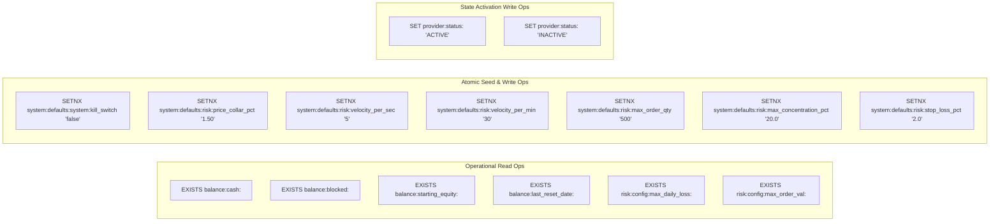

# Startup Flow - Redis Keyspace Defaults & Provider State Activation

## Overview

The **Startup Flow** governs how microservices (`order-processing-service` and `order-management-service`) bootstrap their Redis state context during application initialization. It handles non-destructive default key seeding and verifies mandatory broker account state completeness before allowing trading activities.

---

## PlantUML Sequence Diagram

<!-- ```puml
@startuml -->
!include startup.puml
<!-- ''@enduml
``` -->

---

## Detailed Step-by-Step Execution Sequence

### 1. Spring Context & Redis Facade Instantiation
During Spring Boot application bootstrap, [`SharedRedisConfiguration`](file:///c:/Users/jeshu/Projects/distributed-trading-system/CombinedOrderingSystem/libs/shared-models/src/main/java/com/trading/shared/redis/SharedRedisConfiguration.java) instantiates the enterprise client facade [`TradingRedisFacade`](file:///c:/Users/jeshu/Projects/distributed-trading-system/CombinedOrderingSystem/libs/shared-models/src/main/java/com/trading/shared/redis/TradingRedisFacade.java) around Spring's `StringRedisTemplate`.

### 2. Non-Destructive Redis Keyspace Default Seeding
The [`RedisDefaultsInitializer`](file:///c:/Users/jeshu/Projects/distributed-trading-system/CombinedOrderingSystem/libs/shared-models/src/main/java/com/trading/shared/redis/RedisDefaultsInitializer.java) runner executes automatically:
- Iterates over all enum symbols in [`RedisKeyDef`](file:///c:/Users/jeshu/Projects/distributed-trading-system/CombinedOrderingSystem/libs/shared-models/src/main/java/com/trading/shared/redis/RedisKeyDef.java).
- Identifies keys where `isDefaultAllowed() == true` and `getDefaultRedisKey()` is defined (e.g. `system:defaults:system:kill_switch`, `system:defaults:risk:price_collar_pct`, etc.).
- Executes an **atomic `SETNX` (`setIfAbsent`)** command against Redis for each default key.
- **Concurrency Safety**: If multiple microservices start simultaneously, Redis `SETNX` guarantees that only the first caller writes the seed value, while subsequent callers perform a no-op without mutating active runtime overrides.

### 3. Proactive gRPC Startup Health Probing (OPS)
In `order-processing-service`, [`OrderExecutionClient.@PostConstruct`](file:///c:/Users/jeshu/Projects/distributed-trading-system/CombinedOrderingSystem/ms/order-processing-service/src/main/java/com/trading/ops/service/OrderExecutionClient.java) executes:
- Proactively probes the gRPC `connection-manager-alpaca:50051` health endpoint (`checkHealth("alpaca")`).
- If gRPC responds `HEALTHY`, delegates state activation to [`ProviderStateManager.markProviderActive("alpaca")`](file:///c:/Users/jeshu/Projects/distributed-trading-system/CombinedOrderingSystem/libs/shared-models/src/main/java/com/trading/shared/state/ProviderStateManager.java).

### 4. Mandatory Key Completeness Check & Activation
[`ProviderStateManager.markProviderActive("alpaca")`](file:///c:/Users/jeshu/Projects/distributed-trading-system/CombinedOrderingSystem/libs/shared-models/src/main/java/com/trading/shared/state/ProviderStateManager.java) performs prerequisite checks:
1. Verifies that `ProviderConfig.isConfigComplete()` is `true`.
2. Calls `getMissingRequiredProviderKeys("alpaca")`, inspecting Redis for all mandatory non-defaultable keys (`KeyScope.PROVIDER`, `defaultAllowed=false`):
   - `balance:cash:alpaca`
   - `balance:blocked:alpaca`
   - `balance:starting_equity:alpaca`
   - `balance:last_reset_date:alpaca`
   - `risk:config:max_daily_loss:alpaca`
   - `risk:config:max_order_val:alpaca`
3. **Activation**: If all required keys exist in Redis, sets in-memory `active = true` AND writes `provider:status:alpaca` = `"ACTIVE"` via `SET`.
4. **Deactivation Fallback**: If any key is missing, logs a warning and writes `provider:status:alpaca` = `"INACTIVE"`.

---

## Operational Level Reads & Writes Grouping



### Detailed Operational Key Operations Table

| Key Affected | Operation Type | Redis Primitive | Caller Method | Operational Purpose |
| :--- | :--- | :--- | :--- | :--- |
| `system:defaults:<key>` | Atomic Seed Write | `SETNX` | `RedisDefaultsInitializer.run` | Non-destructive seeding of baseline default values. |
| `balance:cash:<provider>` | Read-Only Probe | `EXISTS` | `ProviderStateManager.getMissingRequiredProviderKeys` | Validates cash balance cache presence. |
| `balance:blocked:<provider>` | Read-Only Probe | `EXISTS` | `ProviderStateManager.getMissingRequiredProviderKeys` | Validates blocked margin cache presence. |
| `balance:starting_equity:<provider>`| Read-Only Probe | `EXISTS` | `ProviderStateManager.getMissingRequiredProviderKeys` | Validates day-start equity baseline presence. |
| `balance:last_reset_date:<provider>`| Read-Only Probe | `EXISTS` | `ProviderStateManager.getMissingRequiredProviderKeys` | Validates daily reset date presence. |
| `risk:config:max_daily_loss:<provider>`| Read-Only Probe | `EXISTS` | `ProviderStateManager.getMissingRequiredProviderKeys` | Validates daily loss limit configuration. |
| `risk:config:max_order_val:<provider>`| Read-Only Probe | `EXISTS` | `ProviderStateManager.getMissingRequiredProviderKeys` | Validates single-order value cap configuration. |
| `provider:status:<provider>` | State Write | `SET` | `ProviderStateManager.markProviderActive` / `markProviderInactive` | Updates provider health state (`ACTIVE`/`INACTIVE`). |
